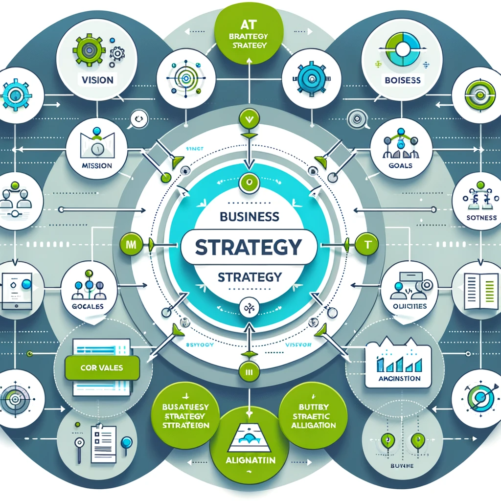
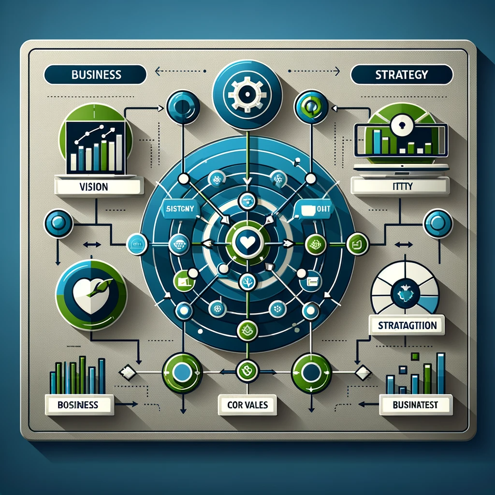
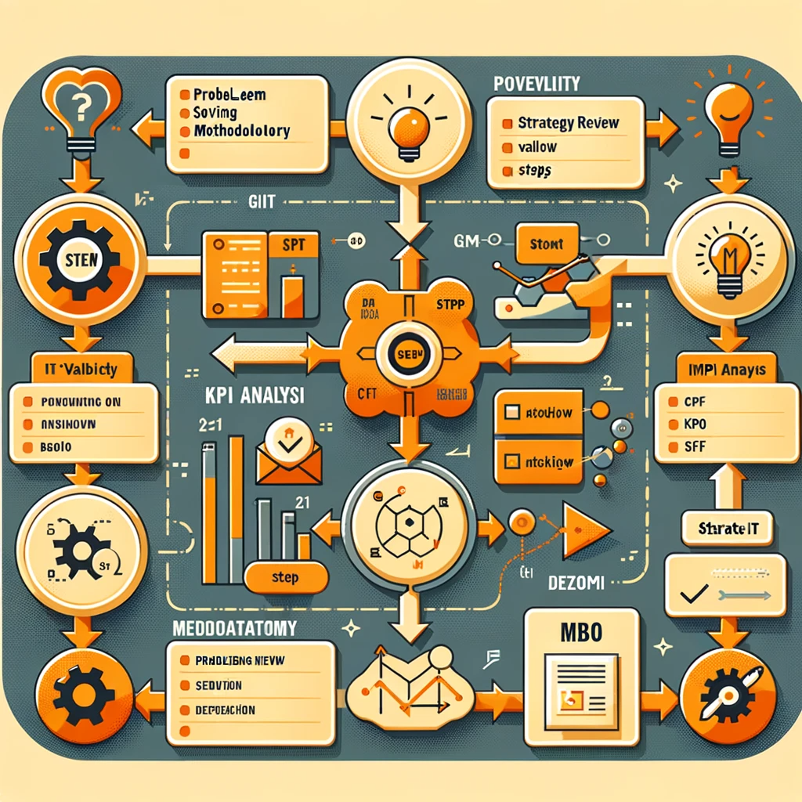
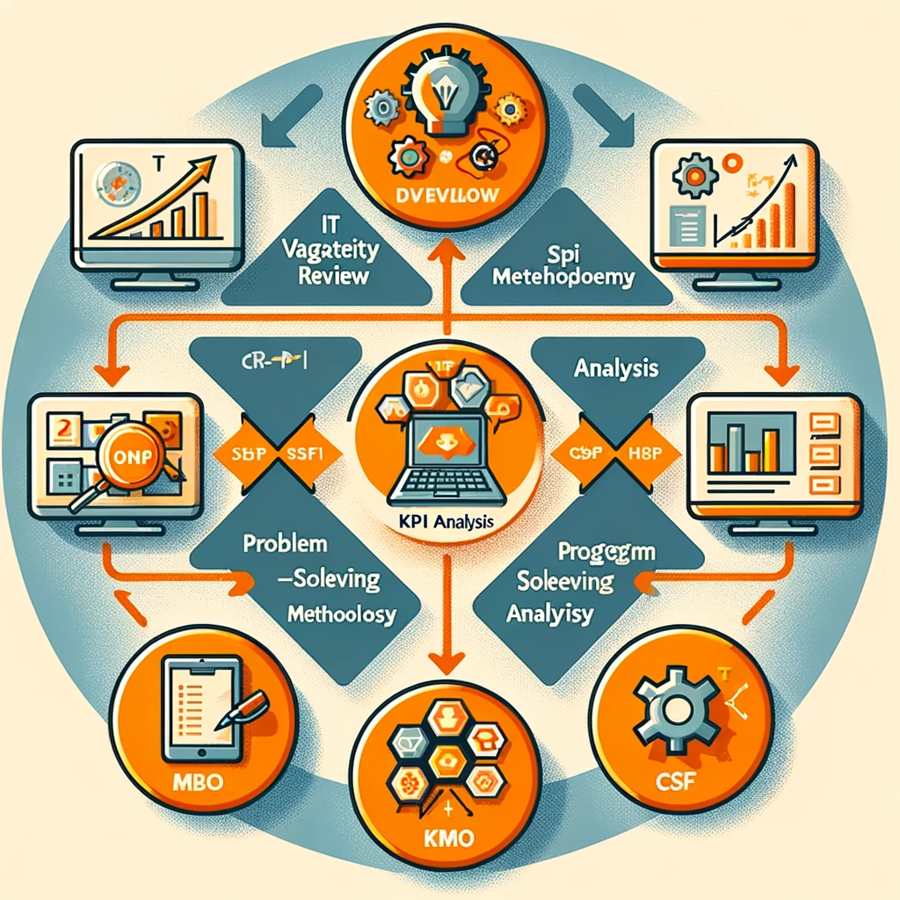

### 5.2 Planning for IT Businesses
- **Strategies for IT Businesses (5.2.1)**
  - **IT Business Strategies (5.2.1.1)**
    - **Concepts of Strategy (5.2.1.1.1)**: Visions and missions, the connection between businesses and IT, core values of IT, strategies of IT practice.
      - **Illustration**: Diagram showing the alignment of IT strategy with business strategy.
    - **Strategy Techniques (5.2.1.1.2)**: IT validity review, problem-solving methodology, KPI, MBO, CSF.
      - **Illustration**: Flowchart of IT strategy development process.
  - **Business Environmental Analysis Models (5.2.1.2)**
    - **Models (5.2.1.2.1)**: MECE/LISS, SWOT, PEST, BCG matrix, McKinsey 7S Model, 5-Forces, 3C, 4P.
      - **Illustration**: Comparative table of different analysis models.
- **Establishment of IT Business Plans (5.2.2)**
  - **Enterprise Architecture (EA) (5.2.2.1)**
    - **Components of EA (5.2.2.1.1)**: BA, AA, DA, TA.
      - **Illustration**: Diagram of EA components interconnection.
    - **Extended Areas of EA (5.2.2.1.2)**: EA reference model, EA framework, construction procedures, EAMS.
      - **Illustration**: EA lifecycle diagram.
  - **Information Strategy Planning (ISP) (5.2.2.2)**
    - **ISP Concepts (5.2.2.2.1)**: Establishment procedures, activities by phase, workproducts.
    - **ISMP (5.2.2.2.2)**: Information Strategy Master Plan.
- **Introduction to IT Businesses (5.2.3)**
  - **Procedures of IT Businesses (5.2.3.1)**
    - **Procedures (5.2.3.1.1)**: Ordering, acquisition, supply processes.
      - **Illustration**: Process flowchart for IT business procedures.
  - **Introducing IT Businesses (5.2.3.2)**
    - **Introduction Types (5.2.3.2.1)**: Package introduction, in-house development, ITO.
    - **Evaluation Systems (5.2.3.2.2)**: eSCM.
      - **Illustration**: Comparison chart of IT business introduction types.

Illustrations to visualize these concepts better.

1. **Diagram showing the alignment of IT strategy with business strategy**:
   - This will help in understanding how IT strategies are aligned with overall business goals.

2. **Flowchart of IT strategy development process**:
   - A visual representation of the process of developing IT strategies, including problem-solving methods and strategy techniques. 

These illustrations will provide a quick and effective way to understand and remember these concepts.

Here are the illustrations to accompany the reviewer/cheatsheet for the IT business lessons:

1. **Diagram Showing the Alignment of IT Strategy with Business Strategy**: 
   - This diagram illustrates how IT strategies are aligned with overall business goals, including elements like vision, mission, core values, and the strategic connection between IT objectives and business aims.

2. **Flowchart of IT Strategy Development Process**: 
   - This flowchart depicts the steps involved in developing IT strategies, such as IT validity review, problem-solving methodology, KPI analysis, MBO, and CSF. It uses different shapes and colors to clearly represent each step and the sequence they follow.

These visual aids will help in understanding and memorizing the key concepts from the lessons on planning for IT businesses, strategies, and establishment of IT business plans.